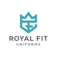

# Royal Fit Uniform - B2B Website



> India's Trusted B2B Uniform Partner for Hotels & Hospitals

A modern, conversion-optimized website for Royal Fit Uniform built with Next.js 14, Tailwind CSS, and TypeScript.

## 🌟 Features

### Core Features
- ✅ Responsive navigation with mega-menu
- ✅ Hero section with trust metrics & animations
- ✅ Service category pages (Hotel/Hospital)
- ✅ Product catalog with filtering
- ✅ Case studies with measurable results
- ✅ Testimonials carousel
- ✅ Trust badges & certifications
- ✅ 3-step multi-step quote form
- ✅ Mobile-first responsive design
- ✅ SEO optimized with metadata

### Technical Stack
- **Framework**: Next.js 14 (App Router)
- **Language**: TypeScript
- **Styling**: Tailwind CSS
- **Icons**: Lucide React
- **Fonts**: Cormorant Garamond + Source Sans 3

## 🚀 Quick Start

```bash
# Clone the repository
git clone https://github.com/vamshichintu002/royal-fit-website.git
cd royal-fit-website

# Install dependencies
npm install

# Create environment file
cp .env.example .env.local

# Run development server
npm run dev
```

Open [http://localhost:3000](http://localhost:3000) to view the website.

## 📁 Project Structure

```
royal-fit-website/
├── app/
│   ├── api/                 # API routes
│   │   └── leads/          # Lead submission endpoint
│   ├── solutions/          # Solution pages
│   │   ├── hotel-uniforms/
│   │   └── hospital-uniforms/
│   ├── globals.css         # Global styles
│   ├── layout.tsx          # Root layout
│   └── page.tsx            # Home page
├── components/
│   ├── Navigation.tsx      # Header & nav
│   ├── Hero.tsx           # Hero section
│   ├── ServiceCards.tsx   # Service showcase
│   ├── ProductCatalog.tsx # Product grid
│   ├── CaseStudies.tsx    # Success stories
│   ├── Testimonials.tsx   # Client reviews
│   ├── TrustBadges.tsx    # Certifications
│   ├── RequestQuoteForm.tsx # Quote form
│   └── Footer.tsx         # Footer
├── data/
│   ├── products.ts        # Product catalog
│   ├── case-studies.ts    # Case studies
│   └── testimonials.ts    # Testimonials
├── lib/
│   ├── airtable.ts        # Airtable client
│   ├── email.ts           # Email service
│   ├── types.ts           # TypeScript types
│   └── utils.ts           # Utilities
├── public/
│   ├── favicon.ico
│   ├── favicon.svg
│   └── ...
├── mcp-server/            # MCP server for AI integration
│   ├── index.ts          # Server implementation
│   ├── README.md         # MCP documentation
│   └── build/            # Compiled output
├── docs/                  # Documentation
└── .env.example          # Environment template
```

## 🔧 Configuration

### Environment Variables

Create a `.env.local` file:

```env
# Airtable
AIRTABLE_API_KEY=your_api_key
AIRTABLE_BASE_ID=your_base_id

# SendGrid
SENDGRID_API_KEY=your_api_key
SENDGRID_FROM_EMAIL=royalfituniform@gmail.com

# Analytics
NEXT_PUBLIC_GA_ID=G-XXXXXXXXXX

# Site
NEXT_PUBLIC_SITE_URL=https://royalfituniform.com
```

## 🎨 Design System

### Colors
| Color | Hex | Usage |
|-------|-----|-------|
| Primary (Teal) | `#227762` | Main brand |
| Gold | `#d9a83f` | Accents, CTAs |
| Charcoal | `#1a1a1a` | Text |

### Typography
- **Display**: Cormorant Garamond (headings)
- **Body**: Source Sans 3 (content)

## 📱 Pages

| Route | Description |
|-------|-------------|
| `/` | Home page with all sections |
| `/solutions/hotel-uniforms` | Hotel uniforms landing |
| `/solutions/hospital-uniforms` | Hospital uniforms landing |

## 🚀 Deployment

### Vercel (Recommended)
1. Push to GitHub
2. Connect to [Vercel](https://vercel.com)
3. Add environment variables
4. Deploy

### Manual Build
```bash
npm run build
npm start
```

## 📊 Integrations

- **Airtable**: Lead management & CRM
- **SendGrid**: Transactional emails
- **Google Analytics**: Traffic analytics
- **MCP Server**: AI assistant integration via Model Context Protocol
- **Calendly**: Consultation booking (planned)
- **Intercom**: Live chat (planned)

## 🤖 MCP Server

This project includes a Model Context Protocol (MCP) server that enables AI assistants like Claude to interact with the Royal Fit Uniform data and capabilities.

### Features
- Query product catalog by category, department, or search
- Access case studies and testimonials
- Submit leads directly to Airtable
- Get product statistics and analytics

### Quick Start
```bash
cd mcp-server
npm install
npm run build
```

For detailed setup and usage instructions, see [mcp-server/README.md](mcp-server/README.md).

## 🛣️ Roadmap

### Phase 1 ✅ (Current)
- [x] Core website with all sections
- [x] Product catalog
- [x] Quote form
- [x] Case studies & testimonials

### Phase 2 (Next)
- [ ] Airtable integration
- [ ] Email notifications
- [ ] Live chat
- [ ] Blog section

### Phase 3 (Future)
- [ ] Customer portal
- [ ] Order tracking
- [ ] SmartFit AI sizing

## 📄 License

Private - Royal Fit Uniform © 2025

## 👥 Contact

- **Website**: [royalfituniform.com](https://royalfituniform.com)
- **Email**: royalfituniform@gmail.com
- **Phone**: +91 93465 49694
